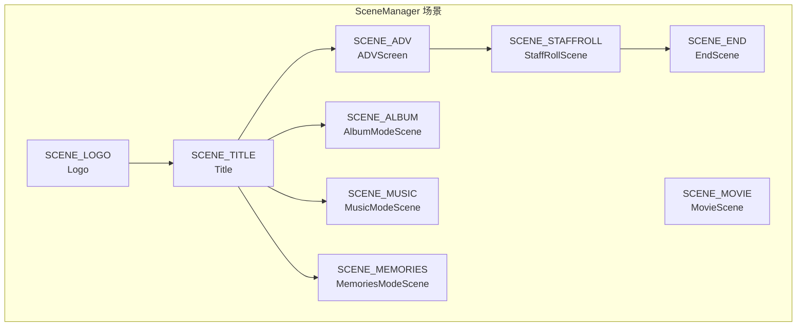
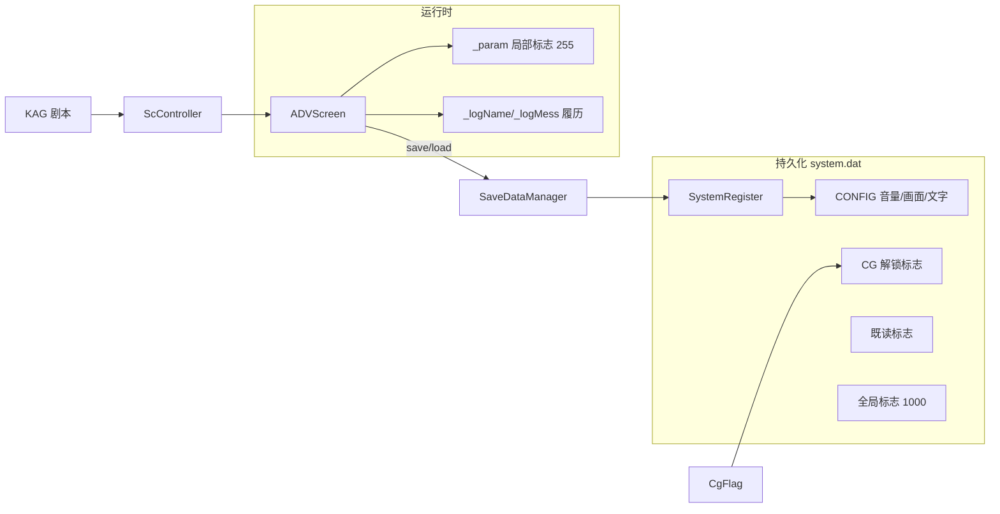

# content-data/system 模块交接文档

> 项目：缘之空 高清重制（ヨスガノソラ / krkrZ 引擎）  
> 路径：`content-data/system/`（42 个文件，约 1.1MB 脚本）  
> 用途：新话题/新开发者快速理解系统层结构与职责边界

---

## 1. 运行时总览

本目录是 **吉里吉里2 / krkrZ 引擎的 TJS 系统脚本层**，负责：

- 游戏启动、资源路径、插件加载
- 场景切换（Logo → 标题 → ADV → 相册/音乐/回想等）
- ADV 剧本解析与演出（KAG 标签）
- UI（消息框、存读档、设置、确认框）
- 存档、全局/局部/CG/既读 标志管理
- 音效、视频、环境特效

**分辨率**：1920×1080（`Status.tjs` 中 `WINDOW_WIDTH/HEIGHT`）

**与 content-data 其他目录的关系**：

| 目录 | 用途 |
|------|------|
| `content-data/scenario/` | KAG 剧本 |
| `content-data/bg_1920/` | 背景图 |
| `content-data/event_1920/` | 事件 CG |
| `content-data/character_1920/` | 立绘 |
| `content-data/audio_ogg/` | 音频 |
| `content-data/ui_1920/` | 存读档等 UI 素材 |
| `content-data/frame/` | 消息框等 frame 素材 |

---

## 2. 启动链路

```
startup.tjs (项目根)
  ├─ k2compat.tjs
  ├─ 注册 content-data/* AutoPath
  ├─ Status.tjs          ← 常量/编译开关/图层 Z 序
  ├─ Initialize.tjs      ← 路径、插件、LoadScript 链、全局对象
  └─ begin.tjs           ← 创建 SceneManager，进入首场景
```

`begin.tjs` 位于 `content-data/begin.tjs`（不在 system 内），逻辑：

- 默认：`SCENE_LOGO`
- 命令行：`-newgame` → ADV；`-album` / `-music` / `-memories` → 对应模式

`Initialize.tjs` 末尾创建的核心全局对象：

| 全局名 | 类型 | 说明 |
|--------|------|------|
| `sysReg` | `SystemRegister` | 持久化配置（`system.dat`） |
| `CONFIG` | Dictionary | `sysReg._config`，音量/画面/文字速度等 |
| `win` | `MainWindow` | 主窗口 |
| `game` | `SceneManager` | 场景管理（在 begin.tjs 创建） |
| `BGM` / `SE` / `ENVSE` / `SYSTEMSOUND` | `SoundLayer` | 音频层 |
| `saveMan` | `SaveDataManager` | 存档管理（System.tjs） |

---

## 3. 脚本加载顺序（Initialize.tjs）

```
【引擎基础层】
Utility → AffineLayer → Sprite → Window → MessageArea
→ GdiPlusCompat → KAGParserCompat → ScController → SelectItem
→ GameSceneManager → ADVObject → ADVScreen → EditLayer
→ Sound → Action → Movie → AnimationSequence

【游戏专用层】
System → MessageFrame → Confirm → SystemWindow → ConfigWindow
→ CgSetupInfo → SetupADVObject → Title → PlaySystemVoice
→ EyeCatch → Album → CgFlag → StaffRoll → EnvEffect
```

Debug 模式额外加载：`debugUtility.tjs`、`DebugController.tjs`

---

## 4. 场景架构



场景常量定义于 `GameSceneManager.tjs`，各场景类分散在对应文件（见下表）。

---

## 5. 类继承关系（简化）

```mermaid
flowchart BT
    Layer --> AffineLayer --> Sprite
    Layer --> EditLayer
    Layer --> MessageArea
    Sprite --> MainWindow的各UI

    InputNotifyBase --> SceneBase --> SceneManager
    InputNotifyBase --> MainWindow

    SceneBase --> Logo / Title / ADVScreen / Album* / EndScene

    KAGParserCompat --> ScController
    KAGParserCompat --> AnimationSequenceController

    SelectItemNotifyBase --> MessageFrame / SettingWindowBase
    SettingWindowBase --> ConfigWindow / LoadSaveWindow / HistoryWindow / ConfirmWindow
```

---

## 6. 文件清单（按职责分组）

### 6.1 入口与常量

| 文件 | 行数 | 职责 |
|------|------|------|
| **Status.tjs** | ~143 | 编译开关（`__DEBUGMODE__`、`__TRIAL__`、`__FILE_CRYPT__`）；游戏名/版本；1920×1080 参数；图层 Z 序 `LAYER_*`；存档/CG/既读 标志上限；M5 立绘 HD 缩放常量 |
| **Initialize.tjs** | ~301 | 单实例锁、异常处理、AutoPath（含 content-data 优先路径）、插件 DLL、`LoadScript` 链、全局资源预加载 |

### 6.2 引擎基础设施

| 文件 | 行数 | 职责 |
|------|------|------|
| **Utility.tjs** | ~1746 | 工具库：`Flag`/`Parameter`/`Point`/`Rect`/`Size`/`D2Matrix`/`Linear`/`Spline`/`RingBuffer`/`TimeKeeper` 等；颜色/字符串/数学辅助函数 |
| **AffineLayer.tjs** | ~656 | 带仿射变换的 Layer 基类（缩放/旋转/锚点） |
| **Sprite.tjs** | ~280 | 继承 `AffineLayer` 的 Sprite，游戏 UI /sprites 基类 |
| **Window.tjs** | ~624 | `MainWindow`：窗口尺寸、全屏/缩放、输入分发（`InputNotifyBase`）、鼠标追踪 |
| **MessageArea.tjs** | ~728 | 文本渲染 Layer；`PrerenderedFontInit()` 预渲染字体注册 |
| **GdiPlusCompat.tjs** | ~141 | GDI+ 外观兼容层（krkrZ 迁移用） |
| **KAGParserCompat.tjs** | ~452 | 纯 TJS 实现的 KAG 脚本解析器（替代/兼容 `KAGParserEx.dll`） |
| **ScController.tjs** | ~184 | 剧本控制器，继承解析器，定时驱动标签执行、宏、wait 恢复 |
| **SelectItem.tjs** | ~2397 | UI 控件库：`Button`/`ToggleButton`/`Slider`/`RadioButton`/`SubMenu`/`ChainItemBase` 等 |
| **EditLayer.tjs** | ~551 | 可编辑 Layer（调试/特殊输入） |
| **Action.tjs** | ~558 | 属性动画：`LinearAction`/`WaveAction`/`ActionSequense`/`ActionList` |
| **Sound.tjs** | ~565 | `SoundBuffer`、`SoundLayer`（BGM/SE/语音层封装） |
| **Movie.tjs** | ~94 | `MovieLayer extends VideoOverlay`，视频播放层 |
| **AnimationSequence.tjs** | ~674 | 动画序列控制器与列表（KAG 扩展演出） |
| **csvParserCompat.tjs** | ~32 | CSV 解析兼容（配合 `charData.csv`） |
| **TraceLog.tjs** | ~30 | 迁移调试用 trace 日志（`Debug.notice` + 缓冲） |

### 6.3 ADV 核心（最大模块）

| 文件 | 行数 | 职责 |
|------|------|------|
| **ADVObject.tjs** | ~719 | `ADVObject`/`ADVObjectInfo`：背景/CG/立绘/差分等显示对象 |
| **ADVScreen.tjs** | ~7697 | **ADV 主引擎**：KAG 标签处理、剧本推进、日志/既读、存读档点、相机、环境 tone、cut-in、cinema、flash；内含 `Savedata`/`LoadProcessScreen`/`CinemaStrap` |
| **SetupADVObject.tjs** | ~163 | `SetupCg`/`SetupChar` 等：按文件名规则（E/B/S 前缀）绑定 `CG_SETUP_INFO`，HD 背景走 `bg_1920/` |
| **MessageFrame.tjs** | ~1755 | ADV 内消息框：姓名/正文/语音按钮；`FaceWindow`；系统菜单/快存/跳转/设置子菜单 |

### 6.4 场景与流程

| 文件 | 行数 | 职责 |
|------|------|------|
| **GameSceneManager.tjs** | ~323 | `SceneBase`/`SceneManager`：场景枚举、`changeScene`/`setScene`、场景对象生命周期 |
| **Title.tjs** | ~864 | `Logo`/`MovieScene`/`Title`/`EndScene` |
| **Album.tjs** | ~2512 | `AlbumModeScene`（CG 鉴赏）、`MusicModeScene`、`MemoriesModeScene` 及预览/滑块 UI |
| **staffroll.tjs** | ~507 | `StaffRoll` 滚动演职员表；`StaffRollText`/`StaffRollCg` cut-in |
| **StaffrollSequence.tjs** | ~123 | 各路线 staffroll 时间轴数据（credit/cg 序列） |
| **EyeCatch.tjs** | ~314 | 章节过场：`EyeCatchTime`/`EyeCatchDate` |
| **EnvEffect.tjs** | ~899 | 环境特效：雪/雨/水滴/镜头/背景滚动 |

### 6.5 系统 UI 与配置

| 文件 | 行数 | 职责 |
|------|------|------|
| **System.tjs** | ~1247 | `SystemRegister`（配置/CG/既读/全局标志持久化）；`SaveDataManager`；`CharDataInit()`；`SPR_COVER` 过渡遮罩 |
| **SystemWindow.tjs** | ~2799 | 存读档 `LoadSaveWindow`、履历 `HistoryWindow`、`SettingWindowBase`、侧边菜单；1920 UI 缩放辅助函数 |
| **ConfigWindow.tjs** | ~1766 | 游戏设置界面（音量/画面/文字/跳过等）；`HintBaloon` |
| **Confirm.tjs** | ~307 | `ConfirmWindow` 确认框、`InformationWindow` 信息提示 |
| **PlaySystemVoice.tjs** | ~74 | 系统语音随机播放（标题 call、设置项 voice 等），按角色路线过滤 |

### 6.6 数据与配置表（非类脚本）

| 文件 | 行数 | 职责 |
|------|------|------|
| **CgSetupInfo.tjs** | ~135 | `CG_SETUP_INFO`：各 BG/CG 的 center、环境 tone（`BG_TONE` 模板：昼/夕/夜/雨等） |
| **CgModeList.tjs** | ~322 | CG 模式画廊分组与预览 pre/post 标签参数 |
| **CgFlag.tjs** | ~1416 | `CG_FLAG_LIST`：每个 CG/场景对应的解锁标志 ID 映射（超大字典） |
| **charData.csv** | 13 | 角色表：index/id/buid/vcid/姓名/排序/关系 |
| **charData.csv.tjs** | 16 | CSV 的 TJS 数组备份（`global._charData_csv_data`） |
| **PRFont.tjs** | 37 | 预渲染字体列表（スーラ/ニューシネマ/ハミング/ロダン/筑紫明朝 等多字号） |
| **movie.ks** | 35 | 开场/各路线 staffroll 用的 KAG 迷你脚本（`@playMovie`/`@Staffroll`） |
| **movie.ks.ctx** | 1 | movie.ks 编译上下文 |

---

## 7. 关键全局数据流



---

## 8. 修改时的常见切入点

| 需求 | 优先查看 |
|------|----------|
| 改分辨率/UI 布局 | `Status.tjs`、`SystemWindow.tjs`、`ConfigWindow.tjs`、`MessageFrame.tjs` |
| 改 HD 背景/CG 路径 | `SetupADVObject.tjs`、`Initialize.tjs` AutoPath |
| 新 KAG 标签 / 剧本行为 | `ADVScreen.tjs` 标签 handler、`ScController.tjs` |
| 存档格式/槽位 | `System.tjs` `SaveDataManager`、`ADVScreen.tjs` `Savedata` |
| CG 解锁/画廊 | `CgFlag.tjs`、`CgModeList.tjs`、`Album.tjs` |
| 标题/Logo/流程 | `Title.tjs`、`GameSceneManager.tjs`、`begin.tjs` |
| 音量/设置项 | `System.tjs` `DEFINE_PARAM`、`ConfigWindow.tjs` |
| 角色 ID/语音前缀 | `charData.csv`、`System.tjs` `CharDataInit` |
| 环境光/时间段 tone | `CgSetupInfo.tjs` `BG_TONE` |
| 立绘 HD 缩放 | `Status.tjs` `M5_BUSTUP_*` |
| krkrZ 迁移/解析问题 | `KAGParserCompat.tjs`、`GdiPlusCompat.tjs`、`TraceLog.tjs` |

---

## 9. 体量与复杂度提示

- **最大文件**：`ADVScreen.tjs`（~7700 行）—— ADV 标签、演出、存档点几乎全在此，改动需极度谨慎
- **第二大**：`SelectItem.tjs`（~2400 行）、`SystemWindow.tjs`（~2800 行）、`Album.tjs`（~2500 行）
- **数据驱动**：`CgFlag.tjs`、`CgModeList.tjs`、`StaffrollSequence.tjs` 以字典/数组为主，适合表格式维护
- **编译开关**：改 `Status.tjs` 中 `__DEBUGMODE__` 会联动 Initialize 的 debug 脚本与异常处理

---

## 10. 插件依赖（Initialize.tjs）

```
extrans.dll, csvParser.dll, windowEx.dll,
layerExDraw.dll, fstat.dll, KAGParserEx.dll
(+ getSample.dll @ DEBUG)
```

解析逻辑已有 TJS 兼容层（`KAGParserCompat`），但插件仍被 link。

---

## 11. 相关仓库路径速查

```
yosuga_krkrZ_public_beta_20260604_73241668/
├── startup.tjs              # 包入口
├── content-data/
│   ├── begin.tjs            # 创建 game，选首场景
│   └── system/              # ← 本文档目录
│       └── SYSTEM_HANDOFF.md
```

---